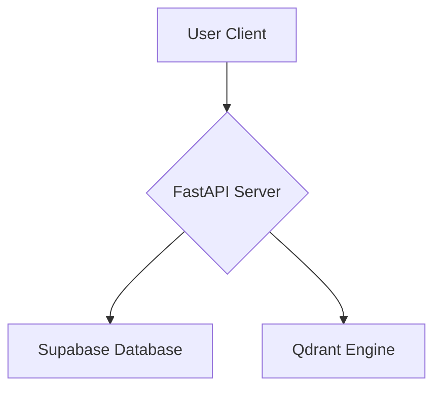
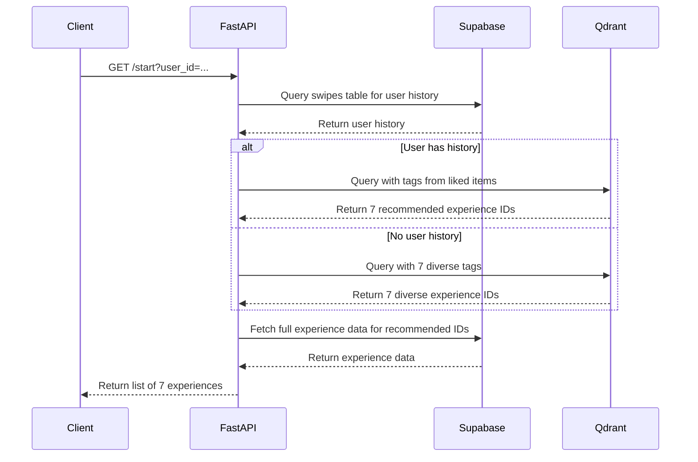
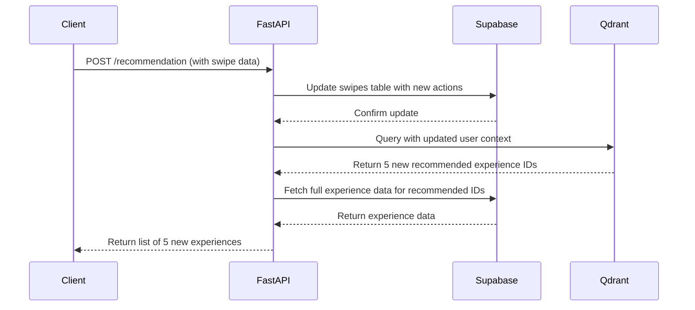
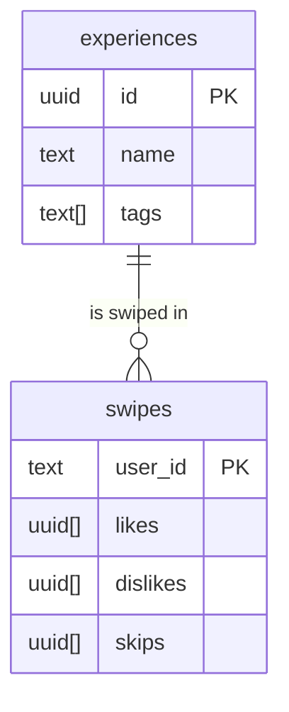

# Swipe Project: Technical Blueprint

**Version:** Stable Beta

---

## 1. High-Level Overview

### 1.1. Project Description

The Swipe Project is a smart experience recommendation system designed to provide users with personalized suggestions based on their interactions. By swiping left (dislike), right (like), or up (skip) on a series of experiences, users generate a preference profile that the system uses to deliver hyper-relevant content.

### 1.2. Functional Goal

The primary goal of the Swipe Project is to solve the problem of choice overload by offering a curated and dynamic feed of experiences tailored to each user's tastes. The system is designed to be intuitive, responsive, and scalable, making it suitable for a wide range of applications, from local activity finders to content discovery platforms.

### 1.3. Core Technologies

- **FastAPI:** A modern, high-performance Python web framework for building the API.
- **Supabase:** An open-source Firebase alternative that provides a PostgreSQL database, authentication, and other backend services.
- **Qdrant:** A vector similarity search engine that powers the recommendation logic.

---

## 2. Detailed Architectural Flow

### 2.1. Component Roles

- **FastAPI Server:** Serves as the central hub of the application, handling all API requests, orchestrating the data flow between the client, Supabase, and Qdrant.
- **Supabase:** Acts as the persistent storage layer, housing the `experiences` and `swipes` tables. It is the single source of truth for all user and experience data.
- **Qdrant:** The intelligence behind the recommendation engine. It stores vector embeddings of the experiences and performs similarity searches to find the best matches for a user.

### 2.2. Session Flow

1.  **User Initiates `/start`:** The user starts a new session, and the client sends a GET request to the `/start` endpoint with the user's ID.
2.  **Check Supabase for History:** The FastAPI server queries the `swipes` table in Supabase to check if the user has a history of liked items.
    - **If History Exists:** The server extracts the tags from the user's liked experiences and uses them to create a query for the Qdrant engine.
    - **If No History:** The server samples 7 diverse tags from the available experiences to create a baseline for the user's preferences.
3.  **Return 7 Experience Objects:** The server returns a list of 7 experience objects from the `experiences` table, either based on the user's history or the diverse tags.
4.  **`/recommendation` Receives Swipe Data:** The user swipes on the experiences, and the client sends a POST request to the `/recommendation` endpoint with the user's ID and their swipe actions (likes, dislikes, skips).
5.  **Update Supabase and Re-query Qdrant:** The FastAPI server updates the `swipes` table in Supabase with the new swipe data and then re-queries the Qdrant engine with the updated user context to get a new set of recommendations.

---

## 3. Flow Diagrams & System Visuals

### 3.1. Component Diagram

### 3.2. Request Lifecycle: `/start`

### 3.3. Request Lifecycle: `/recommendation`

### 3.4. Database ERD Diagram

---

## 4. Function-Level Documentation

### 4.1. `mainswipe.py`

- **`get_initial_experiences(user_id: str)`:**

  - **Logic:** Handles the `/start` endpoint. Fetches user history from Supabase, determines whether to get recommendations based on history or diverse tags, and returns the initial set of experiences.
  - **Inputs:** `user_id` (string).
  - **Outputs:** A list of 7 experience dictionaries.

- **`get_recommendations(request: SwipeRequest)`:**
  - **Logic:** Handles the `/recommendation` endpoint. Updates the user's swipes in Supabase, gets new recommendations from Qdrant based on the updated context, and returns the new set of experiences.
  - **Inputs:** A `SwipeRequest` object containing the `user_id` and the lists of `likes`, `dislikes`, and `skips`.
  - **Outputs:** A list of 5 experience dictionaries.

### 4.2. `qdrant_search.py`

- **`QdrantSearchEngine.search_similar(...)`:**
  - **Logic:** This is the core function for getting recommendations. It takes a query, creates a vector embedding, and performs a similarity search in the Qdrant database. It also handles filtering and pagination.
  - **Inputs:** A query string, and optional parameters for filtering, pagination, and other search options.
  - **Outputs:** A list of search result dictionaries, each containing the experience ID, similarity score, and payload.

---

## 5. Advanced Internal Mechanics

### 5.1. Tag Diversity Generation Algorithm

For new users, the system generates a diverse set of initial recommendations by selecting 7 unique tags from the available experiences. This is done to quickly establish a baseline of the user's preferences and avoid showing them a narrow range of options.

### 5.2. How UUIDs are Mapped Between Tables

The `experiences` table has a primary key `id` of type `uuid`. The `swipes` table stores the user's likes, dislikes, and skips as arrays of `uuid`, where each `uuid` corresponds to the `id` of an experience in the `experiences` table. This allows for efficient mapping between the two tables.

### 5.3. Decision Handling for Cold-Start Scenarios

In a cold-start scenario (i.e., when a new user starts a session), the system falls back to the tag diversity generation algorithm to provide the initial set of recommendations. This ensures that the user is presented with a variety of options, even if the system has no prior information about their preferences.

---

## 6. Complete Supabase Integration Strategy

### 6.1. Table Design

The Supabase database consists of two tables: `experiences` and `swipes`. The `experiences` table stores all the available experiences, while the `swipes` table stores the user's interactions with those experiences.

### 6.2. Data Validation

Data validation is performed at the API level using Pydantic models. This ensures that all the data sent to the Supabase database is in the correct format and meets the required constraints.

### 6.3. Indexing & Latency Optimizations

To optimize the performance of the Supabase database, indexes are created on the `user_id` column in the `swipes` table and the `tags` column in the `experiences` table. This allows for faster queries and reduces the latency of the API.

---

## 7. System Behavior Edge Cases

- **Malformed Input:** If the API receives malformed input (e.g., an invalid `user_id` or a `SwipeRequest` with missing fields), it will return a 422 Unprocessable Entity error with a detailed message explaining the error.
- **Partial History:** If a user has a partial history (e.g., they have only liked one or two items), the system will still try to get recommendations based on that history. However, if the history is not sufficient to generate a meaningful set of recommendations, it will fall back to the tag diversity generation algorithm.
- **Redundancy Avoidance:** The system avoids showing the user experiences they have already swiped on. This is done by filtering out the already-swiped experiences from the recommendations.
